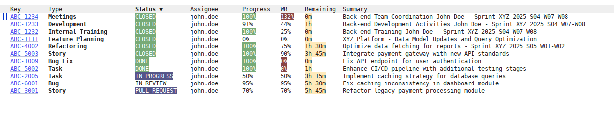
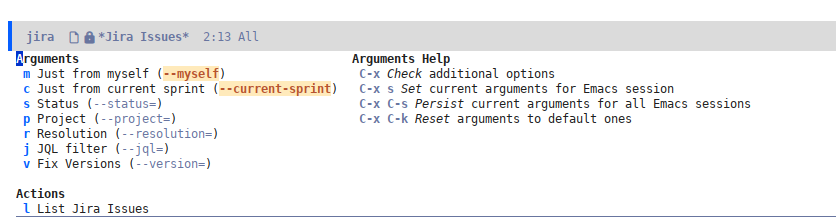
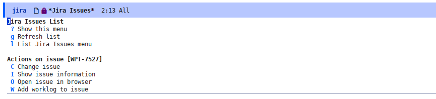
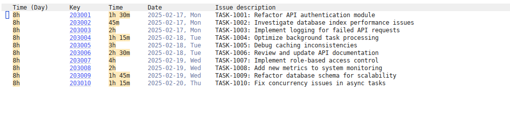

# jira.el

Emacs integration for [Atlassian's Jira](https://www.atlassian.com/software/jira).

[](https://stable.melpa.org/#/jira)

> If you have no choice but to use Jira, at least do it without leaving Emacs.

Supports listing and filtering issues, viewing issue details,
modifying certain properties, and adding worklogs.

Additionally, it provides support for displaying all worklogs from the
[Tempo](https://www.tempo.io/products/jira-time-tracking) integration.

## Screenshots

- List issues



- Filter issues



- Change selected issue



- List [Tempo](https://www.tempo.io/) worklogs



## Installation
This package is available in [MELPA](https://github.com/milkypostman/melpa),
so you just need to do:

```elisp
(use-package jira
  :config
  (setq jira-base-url "https://acme.atlassian.net") ;; Jira instance URL
  (setq jira-username "johndoe@acme.com") ;; Jira username (usually, an email)
  ;; API token for Jira
  ;; See https://support.atlassian.com/atlassian-account/docs/manage-api-tokens-for-your-atlassian-account/
  (setq jira-token "foobar123123")
  (setq jira-token-is-personal-access-token nil)
  (setq jira-api-version 3) ;; Version 2 is also allowed
  ;; (Optional) API token for JIRA TEMPO plugin
  ;; See https://apidocs.tempo.io/
  (setq jira-tempo-token "foobar123123"))
```

You can also install it using
[straight.el](https://github.com/radian-software/straight.el)

```elisp
(use-package jira
  :straight (:host github :repo "unmonoqueteclea/jira.el")
  :demand t
  :config ...)
```

## Authentication
`jira.el` supports two methods for authenticating with the Jira REST API:

1.  **Configuration variables:** You can directly set the
    `jira-username` and `jira-token` variables (and `jira-tempo-token`
    if you use it) in your Emacs configuration (e.g., your `init.el`
    or `config.el`).  This is often the simplest way to get started.

    ```elisp
      (setq jira-username "johndoe@acme.com") ;; Jira username (usually, an email)
	  ;; API token for Jira
	  ;; See https://support.atlassian.com/atlassian-account/docs/manage-api-tokens-for-your-atlassian-account/
	  (setq jira-token "foobar123123")
    ```

    While convenient, storing your token directly in your Emacs
    configuration can pose a security risk if your configuration file
    is not properly protected. Consider using `auth-source` for more
    secure storage.

2.  **`auth-source`:** This is the recommended and more secure
    method. `auth-source` is an Emacs library for managing
    credentials.  It allows you to store your Jira username and API
    token in a secure location (like `~/.authinfo.gpg`) and `jira.el`
    will retrieve them when needed.

    -  **Configure `auth-source`:** Add an entry to your
    `~/.authinfo` or `~/.authinfo.gpg` file (create the file if it
    doesn't exist).

	```
	machine acme.atlassian.net login johndoe@acme.com port https password foobar123123
	```

	And, if you use `tempo.io`:

	```
	machine tempo.io port https password foobar123123
	```

    **`jira.el` will automatically use `auth-source` if `jira-username` and `jira-token` are not explicitly set.**

	⚠️ If you are using a Jira [**Personal Access Token (PAT)**](https://confluence.atlassian.com/enterprise/using-personal-access-tokens-1026032365.html) instead
    of an **API Token**, you will need to set `jira-token-is-personal-access-token`:

	```elisp
	(setq jira-token-is-personal-access-token t)
	```

## Quickstart
Use `M-x jira-issues` to check the list of issues assigned to the
configured user for the active sprint. Once the list is loaded, press
`?` to see the available actions. You can modify the filters, update
the selected issue, add worklogs, and more.

Press `l` to select the filters to be applied to the list of
issues. You can filter by several fields or even write your own `JQL`
filter.

- Thanks to
[transient](https://magit.vc/manual/transient/Saving-Values.html#Saving-Values),
all the transients arguments can be set temporarily or
permanently. See [transient
docs](https://magit.vc/manual/transient/Saving-Values.html#Saving-Values)
for more information.

- Check out [tablist docs](https://github.com/politza/tablist) for additional
keybindings to manage the table (sorting, filtering, exporting, etc)

If you configured [Tempo integration](https://www.tempo.io/), you can
also run `jira-tempo` to view the list of worklogs for the current
week.

## Customization

This is the list of customizations you can set:

- `jira-base-url`: **Mandatory**: Jira instance URL, like: https://acme.atlassian.net
- `jira-username`: Jira username (usually, an email)
- `jira-token`: Jira REST API token
- `jira-api-version`: Jira REST API version. Can be `2` or `3` (default: `3`)
   - ⚠️ Some Jira instances only allow REST API version 2
- `jira-tempo-token`: Jira [tempo.io](https://www.tempo.io/) API token
- `jira-debug`: Whether to log jira.el internal processes data, including API responses
- `jira-issues-table-fields`: Fields to show in the issues table.
   Allowed values are defined in `jira-issues-fields`. Example: `'(:key :issue-type-name :status-name :assignee-name :progress-percent :work-ratio :remaining-time :summary)`
- `jira-issues-max-results`: Maximum number of Jira issues to retrieve
- `jira-tempo-max-results`: Maximum number of Tempo worklogs to retrieve
- `jira-comments-display-recent-first`: The order to display Jira comments in
  issue detail view.
- `jira-use-color-marks`: If true, display color marks in Jira text.
  (default: `t`)
- `jira-status-faces`: Alist mapping status names to faces to override
  default styling (faces are automatically assigned to statuses based
  on the status category: `To Do`, `In Progress` or `Done`). For example:
  ```elisp
  '(("Blocked" . '((t (:foreground "white" :background "darkred" :weight bold)))))
  ```
