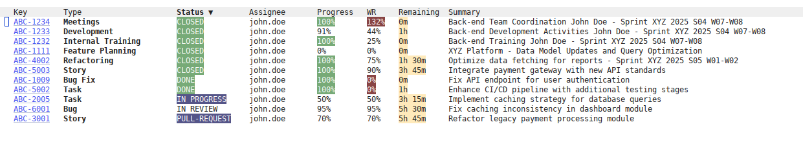
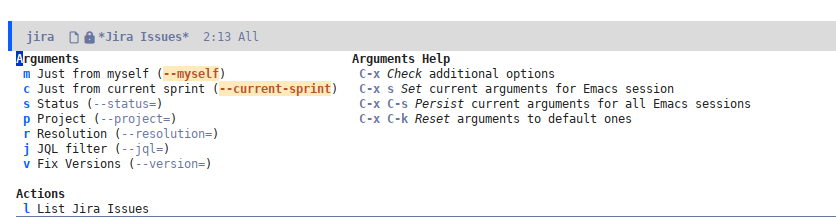
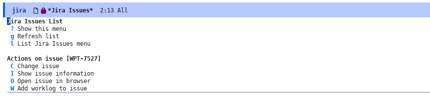
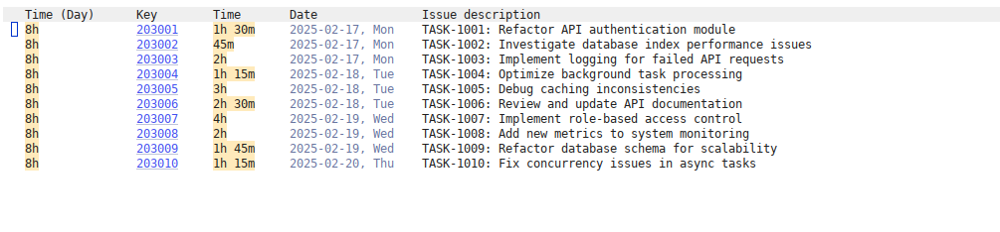

# jira.el

Emacs integration for [Atlassian's Jira](https://www.atlassian.com/software/jira).

[](https://melpa.org/#/jira)
[](https://stable.melpa.org/#/jira)

> If you have no choice but to use Jira, at least do it without leaving Emacs.

## Features

- 📋 **List and filter issues** by assignee, sprint, status, project, type, version,
  your saved Jira filters or any `JQL` query.
- 🔍 **Issue detail view** with description, comments, subtasks, children, linked issues,
  attachments and watchers.
- ✏️ **Edit from Emacs**: change status, update any field with completion, write and edit
  comments and descriptions using Jira markup.
- 🧩 **Create subtasks**, add watchers, upload and delete attachments.
- ⏱️ **Log work** and browse your [Tempo](https://www.tempo.io/products/jira-time-tracking)
  worklogs for the week.
- 📤 **Export** issue lists to `Markdown`, `Org-mode` or `CSV`.
- 🌐 Works with **Jira Cloud and Jira Server / Data Center** (REST API v3 and v2), and with
  **several Jira instances** at once.

| List issues | Filter issues |
|---|---|
|  |  |
| **Change an issue** | **Tempo worklogs** |
|  |  |

## Installation

`jira.el` requires Emacs 29.1 or newer and is available on [MELPA](https://melpa.org/#/jira):

```elisp
(use-package jira
  :config
  (setq jira-base-url "https://acme.atlassian.net"))
```

Or, with [straight.el](https://github.com/radian-software/straight.el):

```elisp
(use-package jira
  :straight (:host github :repo "unmonoqueteclea/jira.el")
  :config
  (setq jira-base-url "https://acme.atlassian.net"))
```

## Authentication

You need an [API token](https://support.atlassian.com/atlassian-account/docs/manage-api-tokens-for-your-atlassian-account/)
for Jira Cloud, or a [Personal Access Token](https://confluence.atlassian.com/enterprise/using-personal-access-tokens-1026032365.html)
for Jira Server / Data Center.

### With `auth-source` (recommended)

Store your credentials in `~/.authinfo.gpg` (or `~/.authinfo`) and leave `jira-username`
and `jira-token` unset:

```
machine acme.atlassian.net login johndoe@acme.com port https password YOUR-API-TOKEN
```

The `machine` must be `jira-base-url` without the `https://` prefix (including the
trailing `/` if your URL has one).

### With variables

Simpler, but keeps the token in your configuration:

```elisp
(setq jira-username "johndoe@acme.com")
(setq jira-token "YOUR-API-TOKEN")
```

When `jira-username` and `jira-token` are set, they are used for every host and
`auth-source` is ignored.

### Jira Server / Data Center

If you use a Personal Access Token, or your instance only supports REST API v2:

```elisp
(setq jira-token-is-personal-access-token t)
(setq jira-api-version 2)
```

### Tempo (optional)

To list Tempo worklogs, add a [Tempo API token](https://apidocs.tempo.io/), either in
`auth-source`:

```
machine tempo.io port https password YOUR-TEMPO-TOKEN
```

or with `(setq jira-tempo-token "YOUR-TEMPO-TOKEN")`.

### Several Jira instances

Add one `auth-source` entry per host and list the extra hosts in `jira-secondary-urls`:

```elisp
(setq jira-base-url "https://acme.atlassian.net")
(setq jira-secondary-urls '("https://other.atlassian.net"))
```

Press `H` in the issues list to switch between them.

## Usage

Run `M-x jira-issues`. In any `jira.el` buffer, press `?` to see every available action.

### Issues list

The list starts with the issues assigned to you. Press `l` to open the filters menu: toggle
or set the filters you want and press `l` again to list. Press `F` there to use one of
your saved Jira filters, or `j` to write a `JQL` query. The filters you list with are
remembered for the session; press `C-x C-k` in the menu to reset them.

| Key | Action |
|---|---|
| `l` | Filter and list issues |
| `g` | Refresh the list |
| `I` | Show issue detail |
| `C` | Change status, resolution or remaining estimate of the selected issues |
| `W` | Add a worklog |
| `O` | Open issue in the browser |
| `c` | Copy issue key |
| `f` | Find an issue by key or URL |
| `e` | Export the list (Markdown, Org-mode or CSV) |
| `T` | Go to Tempo worklogs |
| `H` | Switch Jira host |
| `M-n` / `M-p` | Next / previous page |
| `?` | Show all actions |

The list is a [tablist](https://github.com/politza/tablist) buffer, so you can also mark
several issues (`m`, `u`) to change them at once, and sort or filter the table.

### Issue detail

| Key | Action |
|---|---|
| `C` | Change status |
| `U` | Update a field (summary, description, assignee, priority, labels, ...). Defaults to the field under the cursor |
| `+` | Add a comment |
| `e` | Edit the comment at point |
| `-` | Delete the comment at point |
| `S` | Create a subtask |
| `A` | Attach a file |
| `w` | Add or remove watchers |
| `P` | Show the parent issue |
| `K` | List the issue's children |
| `O` | Open issue in the browser |
| `g` | Refresh |
| `?` | Show all actions |

Sections are collapsible with `TAB`. On a subtask, child or linked issue, `RET` opens it;
on an attachment, `RET` shows it and `d` deletes it.

### Writing comments and descriptions

Comments and descriptions open in an editor buffer using
[Jira text markup](https://jira.atlassian.com/secure/WikiRendererHelpAction.jspa?section=all):
`*bold*`, `_italic_`, `` `code` ``, `[title|https://example.com]`, lists, tables, code
blocks and more. A cheat sheet is included at the bottom of the buffer.

| Key | Action |
|---|---|
| `C-c C-c` | Send |
| `C-c C-k` | Cancel |
| `C-c m` | Mention a user |
| `C-c d` | Insert a date |
| `C-c c` | Insert colored text |

### Attachments from anywhere

`M-x jira-attach-dwim` attaches the active region, the current buffer, or the marked
files in a Dired buffer to an issue. It's handy to bind it globally:

```elisp
(keymap-global-set "C-c j a" #'jira-attach-dwim)
```

### Worklogs and Tempo

Press `W` on an issue to log time. With Tempo configured, `M-x jira-tempo` (or `T` from the
issues list) lists your worklogs for the current week, where `D` deletes the selected one.

### Exporting

Press `e` in the issues list, or run `M-x jira-export-issues`, to export the visible issues
to `Markdown`, `Org-mode` or `CSV`. Issue keys become links.

## Customization

All options are in `M-x customize-group RET jira`. The most useful ones:

| Variable | Description |
|---|---|
| `jira-base-url` | **Required.** Jira instance URL, e.g. `https://acme.atlassian.net` |
| `jira-secondary-urls` | Other Jira instances to switch to with `H` |
| `jira-username`, `jira-token` | Credentials, if not using `auth-source` |
| `jira-token-is-personal-access-token` | Use a Personal Access Token (Bearer auth) |
| `jira-api-version` | REST API version, `3` (default) or `2` |
| `jira-tempo-token` | Tempo API token, if not using `auth-source` |
| `jira-issues-table-fields` | Columns of the issues list, from `jira-issues-fields`, e.g. `'(:key :issue-type-name :status-name :assignee-name :summary)` |
| `jira-issues-max-results` | Issues per page (default `30`) |
| `jira-issues-default-type` | Default issue type filter, e.g. `"Bug"` (default `nil`) |
| `jira-issues-sort-key` | Default sort column, `nil` keeps the `JQL` order (default `("Status" . nil)`) |
| `jira-detail-reuse-buffer` | Reuse one detail buffer for all issues (default `nil`) |
| `jira-comments-display-recent-first` | Show the newest comments first |
| `jira-status-faces` | Custom faces per status name (see below) |
| `jira-use-color-marks` | Show colored text from Jira (default `t`) |
| `jira-datetime-format` | Format for dates and times (default `"%c"`) |
| `jira-users-max-results` | Users to fetch for completion (default `1000`) |
| `jira-tempo-max-results` | Tempo worklogs to fetch (default `50`) |
| `jira-detail-show-announcements` | Show `jira.el` tips in the detail view (default `t`) |
| `jira-debug` | Log requests and responses to `*Messages*` |

Statuses get a face based on their category (to do, in progress, done). To style a
specific status:

```elisp
(defface my-jira-face-review
  '((t (:foreground "white" :background "orange" :weight bold)))
  "Face for the In Review status.")
(setq jira-status-faces '(("In Review" . my-jira-face-review)))
```

All the filter menu arguments can also be saved permanently with `C-x C-s`, see the
[transient docs](https://magit.vc/manual/transient/Saving-Values.html).

## FAQ

- **The issues list is empty and says "Jira API request failed".**
  Look in `*Messages*`. If it says "Unbounded JQL queries are not allowed here", Jira Cloud
  is rejecting a search without any condition: keep at least one filter (for example a
  project or "Just from myself") when listing.

- **Authentication fails although my token is right.**
  Check that the `auth-source` `machine` matches `jira-base-url` without `https://`, and
  that `jira-username` and `jira-token` aren't set to something else. Set `jira-debug` to
  `t` to see the requests in `*Messages*`.

- **Does it work with my on-premise instance?**
  I don't have access to one, so support relies on the official documentation and on
  your issues and PRs. Set `jira-api-version` to `2` if your instance needs it.

- **Does it work with Evil mode?**
  Not currently, as I don't use it. PRs welcome! See
  [#31](https://github.com/unmonoqueteclea/jira.el/issues/31).

## Contributing

Issues and pull requests are very welcome. See the [changelog](changelog.md) for what has
changed in each version.
